# Fallstudie WISS Modul 123
Yanis Sebastian Zuercher & Dominik Koenitzer

26.06.24

## Inhaltsverzeichnis
- Übersicht der Kapitel und Seitenzahlen

## Einführung
- Kurze Beschreibung des Projekts und der Ziele
## Planung
### Netzwerkplan
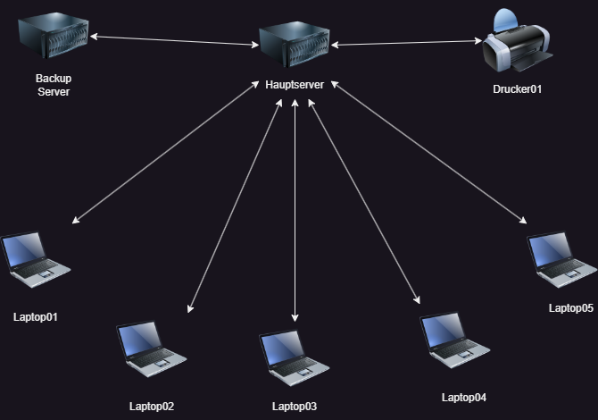
### Adressplanung (Tabellenform)
<table border="1">
    <tr>
        <th>Ressource</th>
        <th>IP-Adresse</th>
        <th>Zuweisung</th>
    </tr>
    <tr>
        <td>Hauptserver</td>
        <td>192.168.1.10</td>
        <td>Statisch</td>
    </tr>
    <tr>
        <td>Backup-Server</td>
        <td>192.168.1.20</td>
        <td>Statisch</td>
    </tr>
    <tr>
        <td>Drucker</td>
        <td>192.168.1.30</td>
        <td>Statisch</td>
    </tr>
    <tr>
        <td>Laptop01</td>
        <td>192.168.1.100</td>
        <td>DHCP</td>
    </tr>
    <tr>
        <td>Laptop02</td>
        <td>192.168.1.101</td>
        <td>DHCP</td>
    </tr>
    <tr>
        <td>Laptop03</td>
        <td>192.168.1.102</td>
        <td>DHCP</td>
    </tr>
    <tr>
        <td>Laptop04</td>
        <td>192.168.1.103</td>
        <td>DHCP</td>
    </tr>
    <tr>
        <td>Laptop05</td>
        <td>192.168.1.104</td>
        <td>DHCP</td>
    </tr>
</table>

### Berechtigungsmatrix
<table border="1">
    <tr>
        <th>Ressource</th>
        <th>Benutzer01</th>
        <th>Benutzer02</th>
        <th>Benutzer03</th>
        <th>Benutzer04</th>
        <th>Benutzer05</th>
        <th>Benutzer06</th>
        <th>Benutzer07</th>
        <th>Benutzer08</th>
        <th>Benutzer09</th>
        <th>Benutzer10</th>
        <th>Admin</th>
    </tr>
    <tr>
        <td>Dateien</td>
        <td>r</td>
        <td>rw</td>
        <td>r</td>
        <td>r</td>
        <td>rw</td>
        <td>r</td>
        <td>rw</td>
        <td>r</td>
        <td>r</td>
        <td>rw</td>
        <td>rwx</td>
    </tr>
    <tr>
        <td>Drucker</td>
        <td>Ja</td>
        <td>Ja</td>
        <td>Ja</td>
        <td>Ja</td>
        <td>Ja</td>
        <td>Ja</td>
        <td>Ja</td>
        <td>Ja</td>
        <td>Ja</td>
        <td>Ja</td>
        <td>Ja</td>
    </tr>
    <tr>
        <td>Backup-Server</td>
        <td>Nein</td>
        <td>Nein</td>
        <td>Nein</td>
        <td>Nein</td>
        <td>Nein</td>
        <td>Nein</td>
        <td>Nein</td>
        <td>Nein</td>
        <td>Nein</td>
        <td>Nein</td>
        <td>Ja</td>
    </tr>
</table>

### Namenskonzepte
- **Geräte:**
  - Hauptserver: Hauptserver
  - Backup-Server: BackupServer
  - Drucker: Drucker01
  - Laptops: Laptop01, Laptop02, Laptop03, Laptop04, Laptop05
  
- **Benutzerkonten:**
  - Benutzer01: Jason Bichsel
  - Benutzer02: Benicio Von Felten
  - Benutzer03: Dominik Könitzer
  - Benutzer04: Perret Pascal
  - Benutzer05: Amza Fatlum
  - Benutzer06: Narcisa Knott
  - Benutzer07: Thomas Waelti
  - Benutzer08: Aleksandar Travanov
  - Benutzer09: Marc Bahnmüller
  - Benutzer10: Patrick Meier
  - Admin: Yanis Sebastian Zürcher
## Installation des Windows Server 2019 in einer VM
**Schritt 1:** Neue VM erstellen

Im VirtualBox Manager auf "Neu" geklickt, um eine neue virtuelle Maschine zu erstellen.

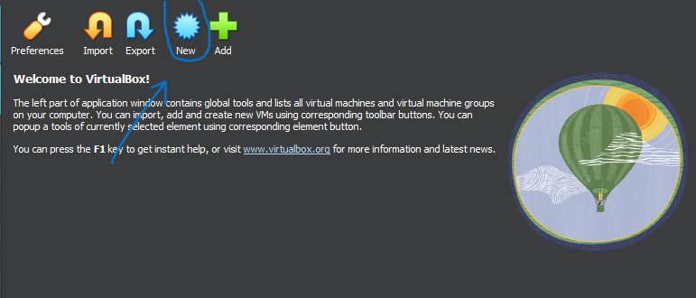

**Schritt 2:** VM konfigurieren

- Name: Windows Server 2019
- Speicherort der VM angegeben
- ISO-Datei für Windows Server 2019 ausgewählt
- "Unattended Installation überspringen" aktiviert

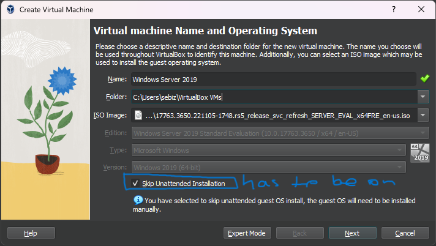

**Schritt 3:** Hardware konfigurieren

- RAM zugewiesen: 14662 MB
- CPUs zugewiesen: 12
- Es sollte im grünen Bereich sein, wie im Bild dargestellt.

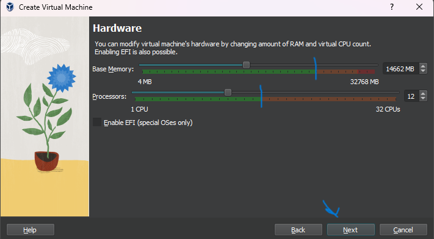

**Schritt 4:** Virtuelle Festplatte erstellen

- Festplattengrösse: 120 GB

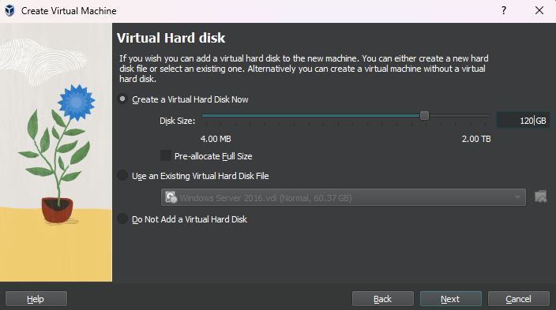

**Schritt 5:** VM-Einstellungen überprüfen und erstellen

- Einstellungen überprüft und auf "Fertigstellen" geklickt

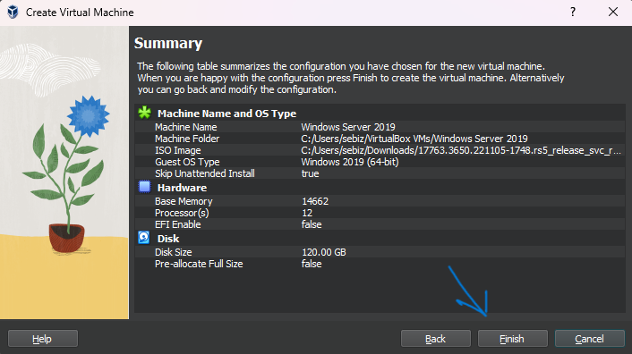

**Schritt 6:** VM starten

- Windows Server 2019 VM ausgewählt und auf "Starten" geklickt

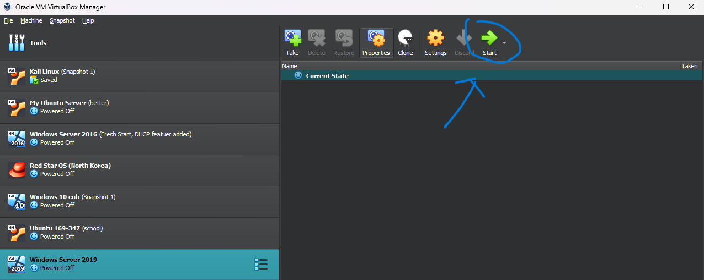

**Schritt 7:** Windows Setup starten

- Sprache, Zeit- und Währungsformat und Tastaturlayout ausgewählt
- Auf "Jetzt installieren" geklickt

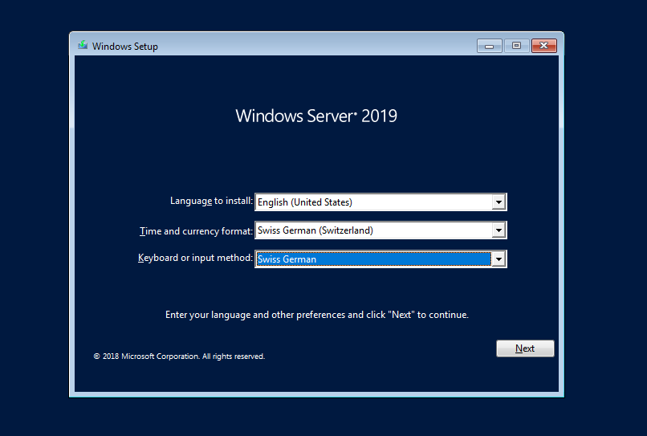

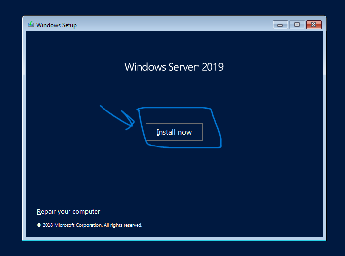

**Schritt 8:** Betriebssystem auswählen

- Edition: Windows Server 2019 Standard Evaluation (Desktop Experience) ausgewählt

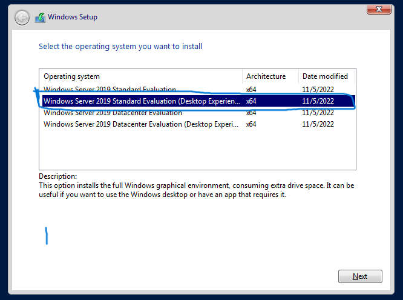

**Schritt 9:** Lizenzbedingungen akzeptieren

- Lizenzbedingungen akzeptiert

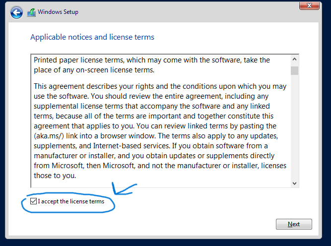

**Schritt 10:** Installationsart auswählen

- "Benutzerdefiniert: Nur Windows installieren (erweitert)" ausgewählt

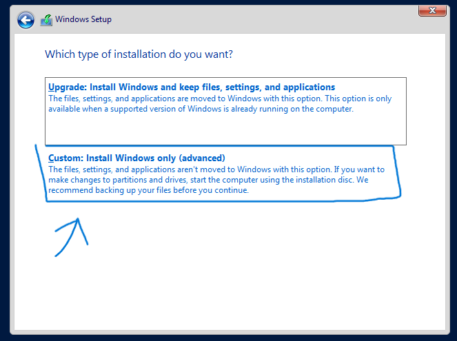

**Schritt 11:** Laufwerk zur Installation auswählen

- Nicht zugewiesenen Speicherplatz (120 GB) ausgewählt und auf "Weiter" geklickt

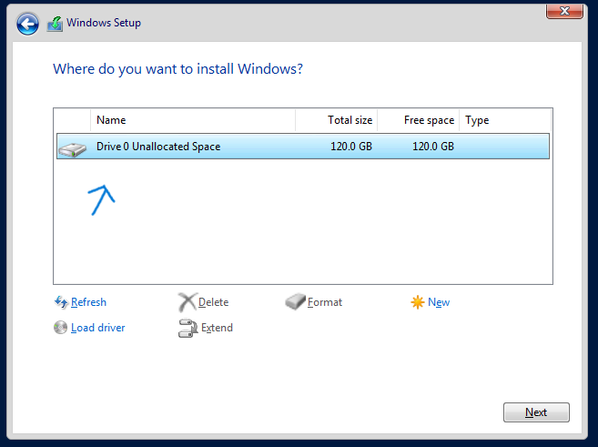

**Schritt 12:** Windows installieren

- Installationsprozess gestartet, Fortschritt verfolgt

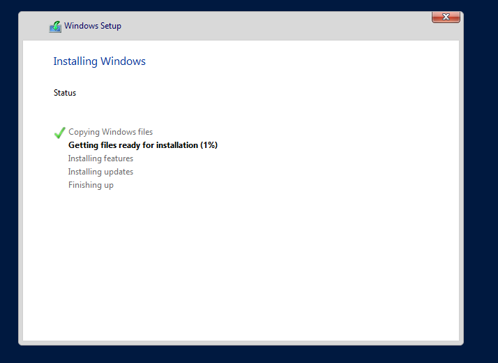

**Schritt 13:** Administrator-Konto einrichten

- Passwort für das Administratorkonto festgelegt

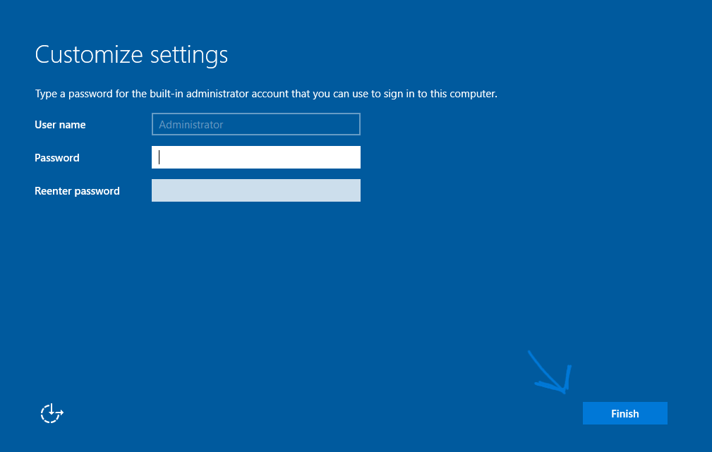

**Schritt 14:** Windows Setup abschließen

- Nach Abschluss des Setups, Anmeldebildschirm erreicht

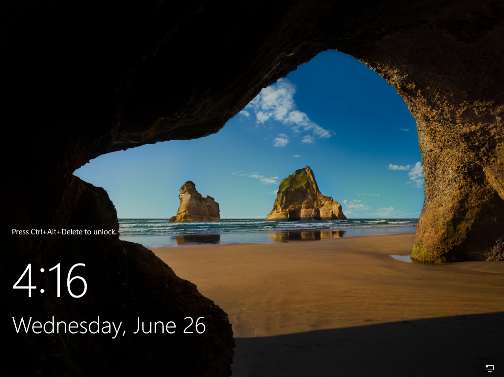

## Einrichtung der Dienste
### DHCP-Server
#### Installationsschritte:

**Schritt 1:** Öffnen des Server Managers

Im Server Manager habe ich auf "Add roles and features" geklickt, um die Rolle des DHCP-Servers hinzuzufügen.

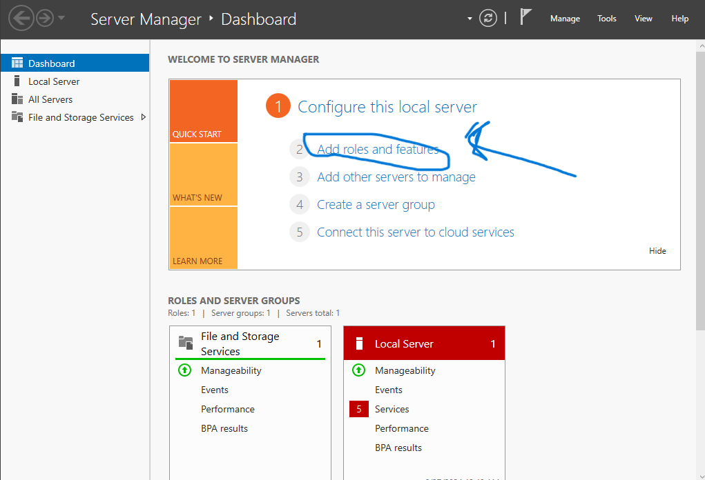

**Schritt 2:** DHCP-Server Rolle auswählen

Ich habe die Rolle "DHCP Server" ausgewählt und installiert.

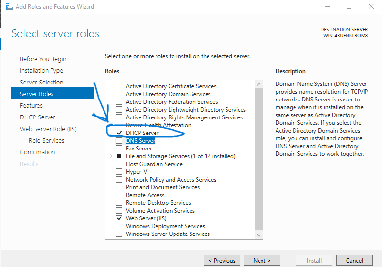

**Schritt 3:** DHCP-Manager öffnen

Nach der Installation habe ich im Server Manager auf "Tools" geklickt und dann "DHCP" ausgewählt.

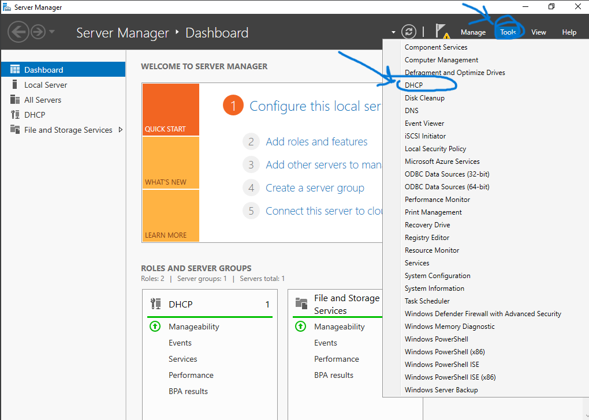

**Schritt 4:** Neuen Bereich hinzufügen

Im DHCP-Manager habe ich auf "IPv4" rechtsgeklickt und "New Scope..." ausgewählt.

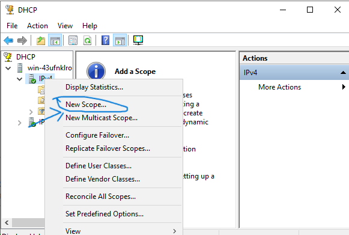

**Schritt 5:** Bereich benennen

Ich habe den Bereich "Scope1" genannt und eine Beschreibung "1" hinzugefügt.

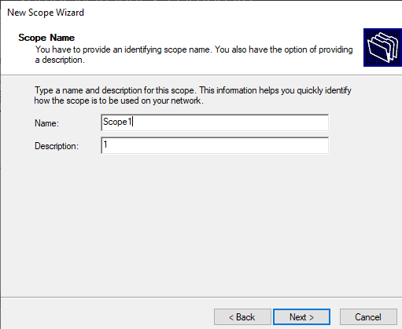

**Schritt 6:** IP-Adressbereich festlegen

Ich habe den Start-IP-Bereich auf `192.168.1.100` und den End-IP-Bereich auf `192.168.1.200` festgelegt. Die Subnetzmaske ist `255.255.255.0`.

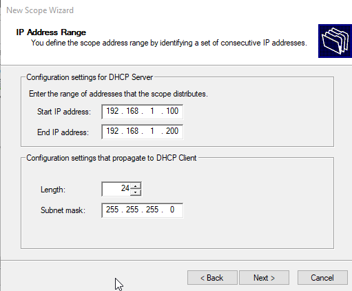

**Schritt 7:** Ausschlüsse und Verzögerung

Ich habe keine Ausschlüsse hinzugefügt und die Standardverzögerung beibehalten.

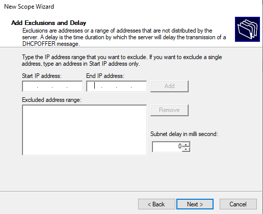

**Schritt 8:** Lease-Dauer festlegen

Ich habe die Lease-Dauer auf 8 Tage eingestellt.
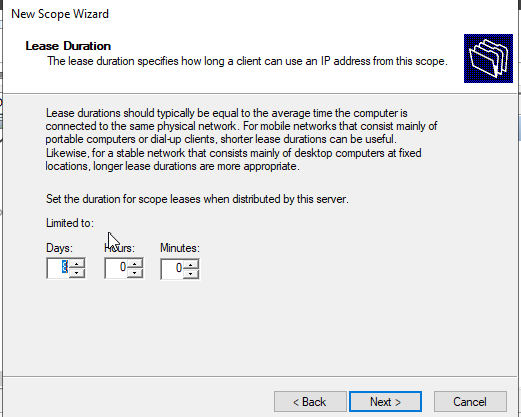

**Schritt 9:** DHCP-Optionen konfigurieren

Ich habe ausgewählt, dass ich die DHCP-Optionen jetzt konfigurieren möchte.

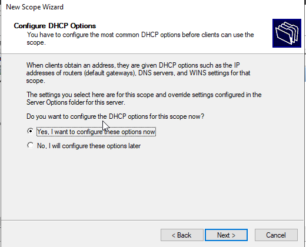

**Schritt 10:** Standard-Gateway konfigurieren

Ich habe die IP-Adresse des Routers als `192.168.1.1` hinzugefügt.

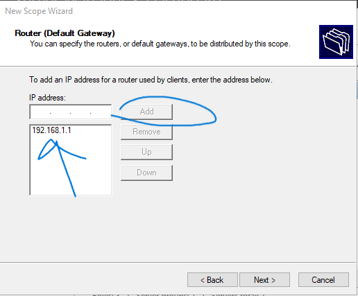

**Schritt 11:** DNS-Server konfigurieren

Ich habe `192.168.1.10` und `8.8.8.8` als DNS-Server hinzugefügt.

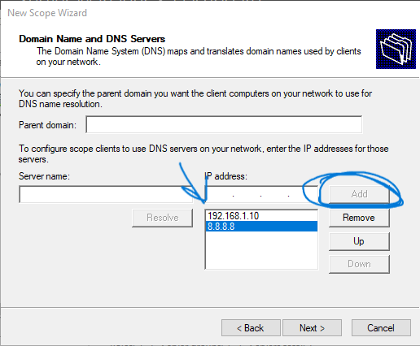

**Schritt 12:** WINS-Server konfigurieren

Ich habe keine WINS-Server hinzugefügt.

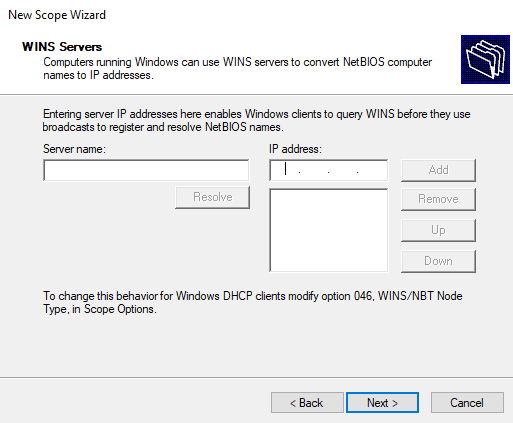

**Schritt 13:** Bereich aktivieren

Ich habe ausgewählt, dass der Bereich jetzt aktiviert wird.

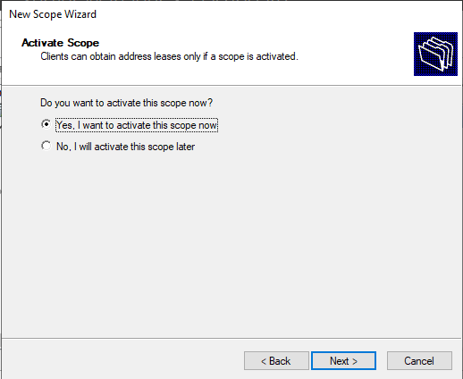

**Schritt 14:** Assistent beenden

Ich habe den Assistenten gefinished.

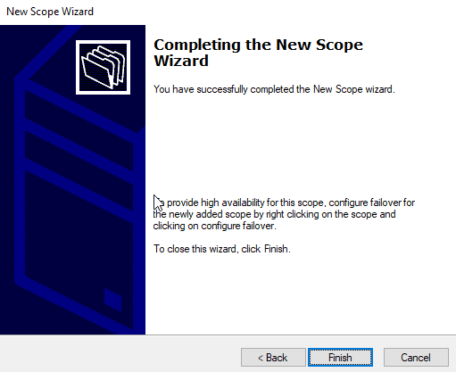

#### Ausschlüsse und Reservierungen

**Schritt 1:** Neue Reservierung hinzufügen

Im DHCP-Manager habe ich auf "Reservations" rechtsgeklickt und "New Reservation..." ausgewählt.

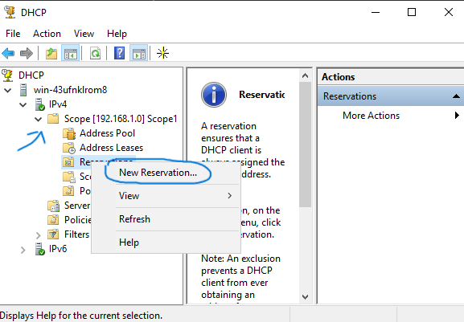

**Schritt 2:** Reservierung für Laptop01

Ich habe eine Reservierung für `Laptop01` mit der IP-Adresse `192.168.1.100` und der MAC-Adresse `90:5b:cd:69:7b:c2` erstellt. Beschreibung: `Benutzer01 - Jason Bichsel`.

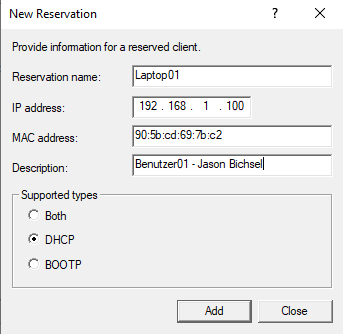

**Schritt 3:** Reservierung für Laptop02

Ich habe eine Reservierung für `Laptop02` mit der IP-Adresse `192.168.1.101` und der MAC-Adresse `ab:12:14:56:00:36` erstellt. Beschreibung: `Benutzer02 - Benicio Von Felten`.

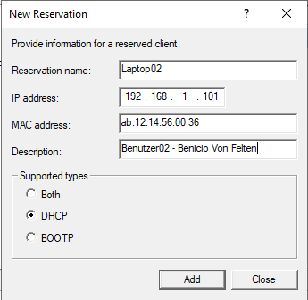

**Schritt 4:** Reservierung für Laptop03

Ich habe eine Reservierung für `Laptop03` mit der IP-Adresse `192.168.1.102` und der MAC-Adresse `5c:e:3:59:1e:b0:62` erstellt. Beschreibung: `Benutzer03 - Dominik Koenitzer`.

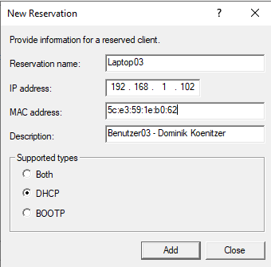

**Schritt 5:** Reservierung für Laptop04

Ich habe eine Reservierung für `Laptop04` mit der IP-Adresse `192.168.1.103` und der MAC-Adresse `77:1e:17:03:ca:5b` erstellt. Beschreibung: `Benutzer04 - Perret Pascal`.

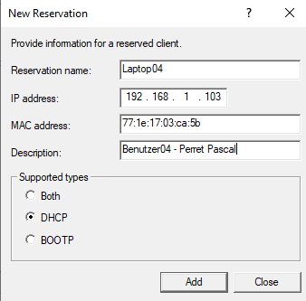

**Schritt 6:** Reservierung für Laptop05

Ich habe eine Reservierung für `Laptop05` mit der IP-Adresse `192.168.1.104` und der MAC-Adresse `16:79:be:6e:70:60` erstellt. Beschreibung: `Benutzer05 - Amza Fatlum`.

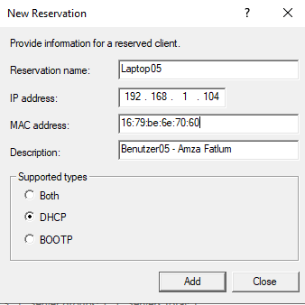

  
## DNS-Server
#### Installationsschritte:

**Schritt 1:** Öffnen des Server Managers

Im Server Manager habe ich auf "Add roles and features" geklickt, um die Rolle des DNS-Servers hinzuzufügen.

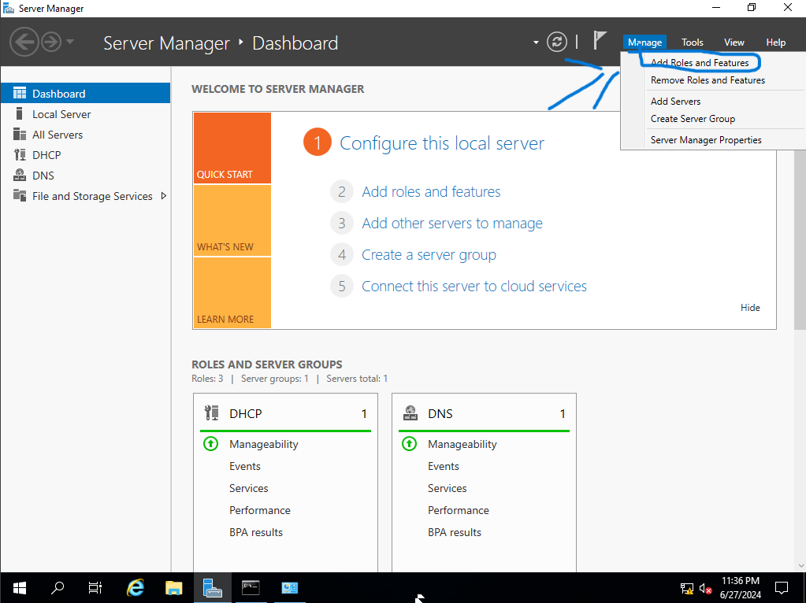

**Schritt 2:** DNS-Server Rolle auswählen

Ich habe die Rolle "DNS Server" ausgewählt und installiert.

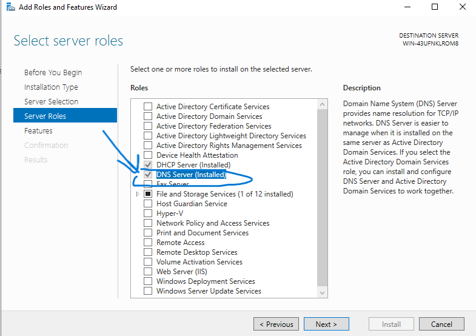

**Schritt 3:** DNS-Manager öffnen

Nach der Installation habe ich im Server Manager auf "Tools" geklickt und dann "DNS" ausgewählt.

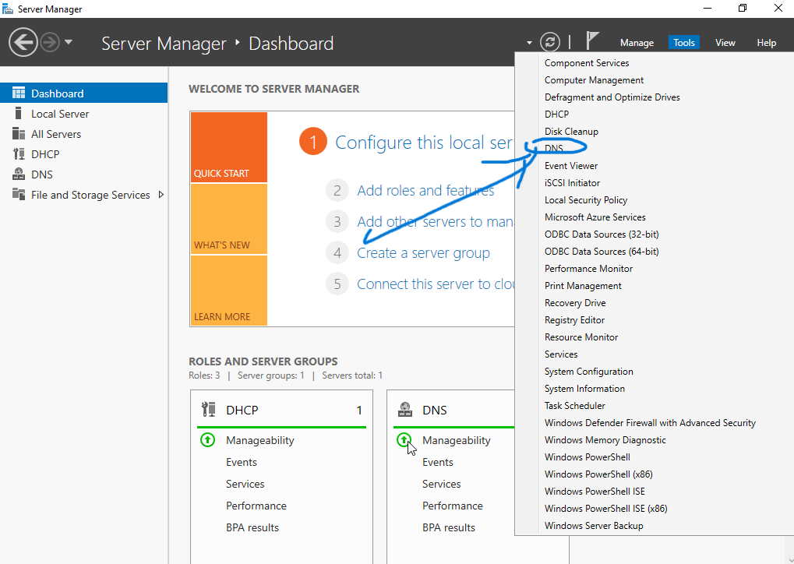

**Schritt 4:** Neue Zone hinzufügen

Im DNS-Manager habe ich auf "Forward Lookup Zones" rechtsgeklickt und "New Zone..." ausgewählt.

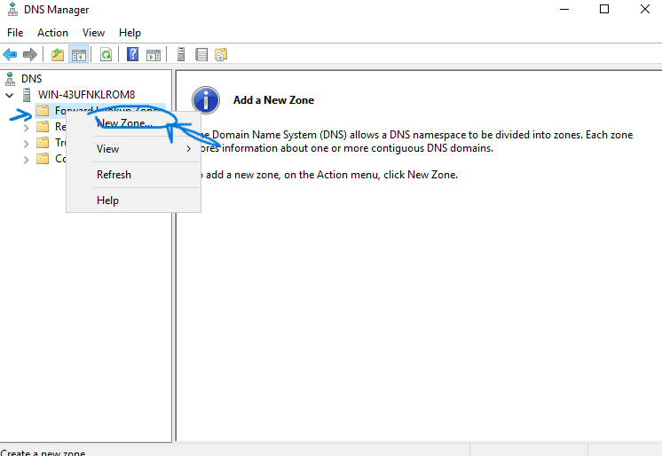

**Schritt 5:** Zonentyp auswählen

Ich habe "Primary zone" ausgewählt.

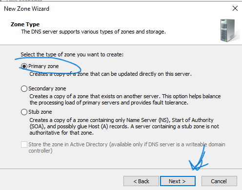

**Schritt 6:** Zonenname eingeben

Ich habe den Zonennamen "test.local" eingegeben.

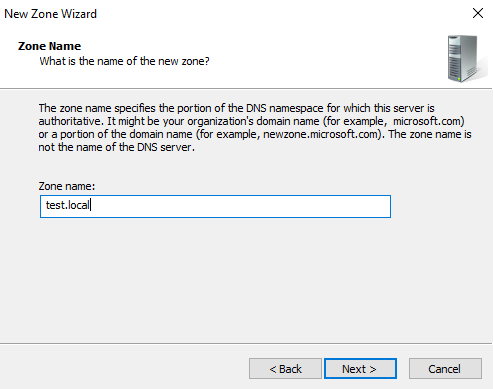

**Schritt 7:** Zonen-Datei erstellen

Ich habe ausgewählt, eine neue Zonen-Datei zu erstellen mit dem Namen "test.local.dns".

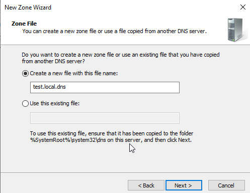

**Schritt 8:** Dynamische Updates konfigurieren

Ich habe ausgewählt, dass keine dynamischen Updates erlaubt sind.

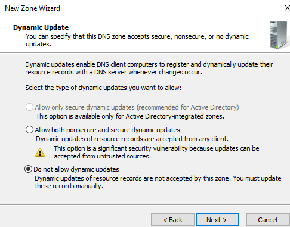

**Schritt 9:** Assistent beenden

Ich habe den Assistenten gefinished.

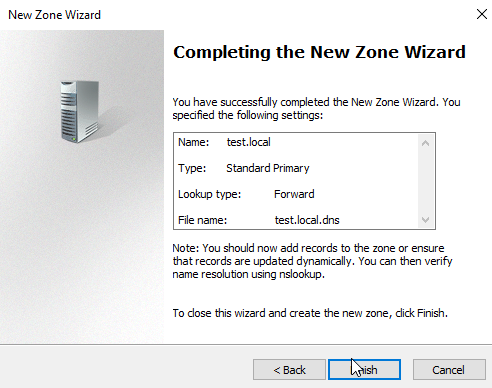

**Schritt 10:** Reverse Lookup Zone hinzufügen

Im DNS-Manager habe ich auf "Reverse Lookup Zones" rechtsgeklickt und "New Zone..." ausgewählt.

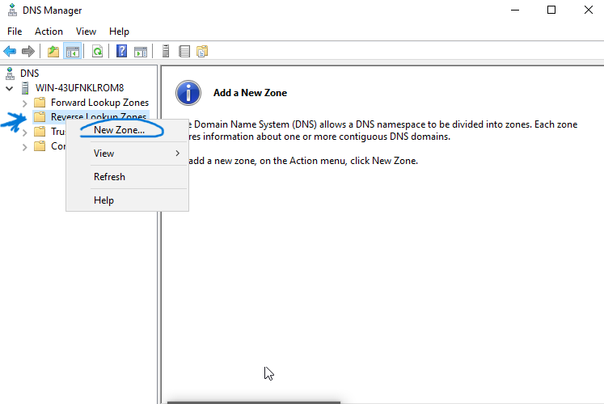

**Schritt 11:** Zonentyp auswählen

Ich habe "Primary zone" ausgewählt.

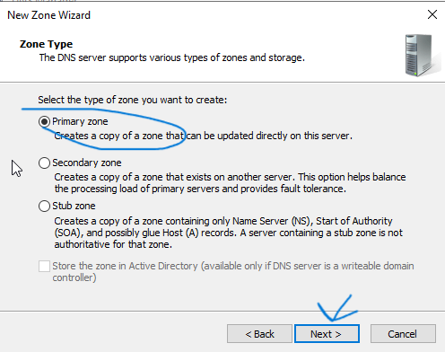

**Schritt 12:** IPv4 Reverse Lookup Zone auswählen

Ich habe "IPv4 Reverse Lookup Zone" ausgewählt.

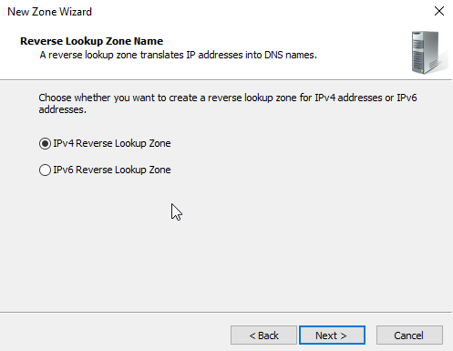

**Schritt 13:** Reverse Lookup Zone Name eingeben

Ich habe den Namen der Reverse Lookup Zone als "0.1.168.192.in-addr.arpa" eingegeben.

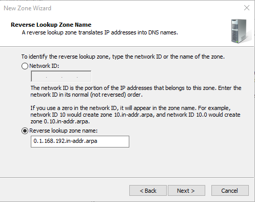

**Schritt 14:** Zonen-Datei erstellen

Ich habe ausgewählt, eine neue Zonen-Datei zu erstellen mit dem Namen "0.1.168.192.in-addr.arpa.dns".

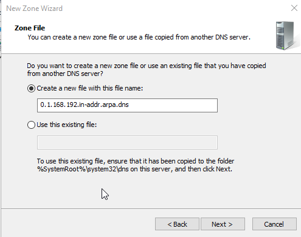

**Schritt 15:** Dynamische Updates konfigurieren

Ich habe ausgewählt, dass keine dynamischen Updates erlaubt sind.

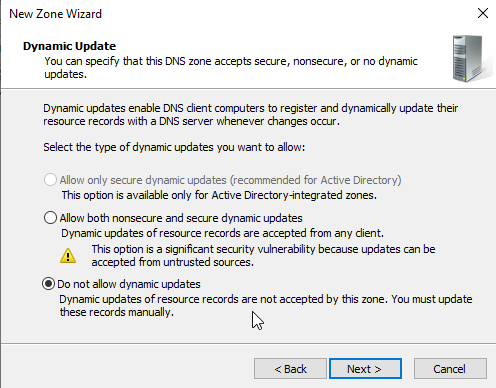

**Schritt 16:** Assistent beenden

Ich habe den Assistenten gefinished.

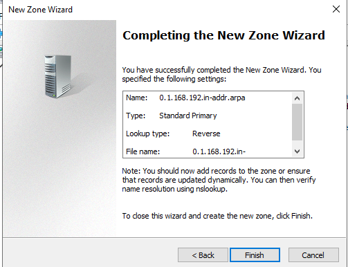

#### Erstellen von DNS-Einträgen

**Schritt 1:** Neuen Host hinzufügen

Im DNS-Manager habe ich auf die Forward Lookup Zone "test.local" rechtsgeklickt und "New Host (A or AAAA)..." ausgewählt.

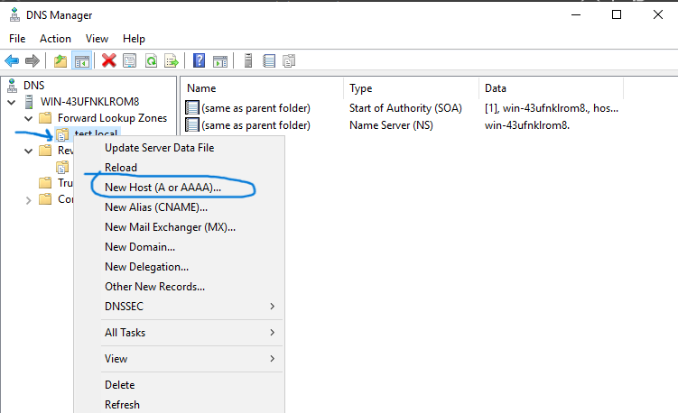

**Schritt 2:** Host für Hauptserver hinzufügen

Ich habe einen neuen Host "Hauptserver" mit der IP-Adresse "192.168.1.10" hinzugefügt.

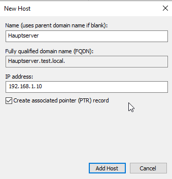

**Schritt 3:** Host für BackupServer hinzufügen

Ich habe einen neuen Host "BackupServer" mit der IP-Adresse "192.168.1.20" hinzugefügt.

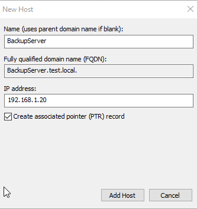

**Schritt 4:** Host für Drucker hinzufügen

Ich habe einen neuen Host "Drucker01" mit der IP-Adresse "192.168.1.30" hinzugefügt.
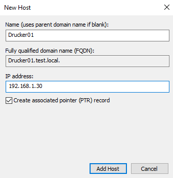

**Schritt 5:** Host für Laptop01 hinzufügen

Ich habe einen neuen Host "Laptop01" mit der IP-Adresse "192.168.1.100" hinzugefügt.

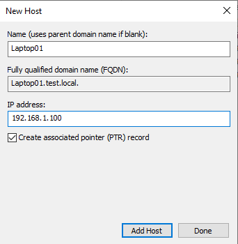

**Schritt 6:** Host für Laptop02 hinzufügen

Ich habe einen neuen Host "Laptop02" mit der IP-Adresse "192.168.1.101" hinzugefüt.

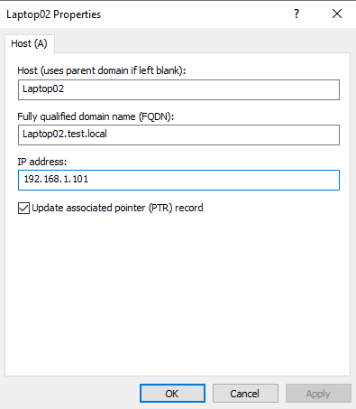

**Schritt 7:** Host für Laptop03 hinzufügen

Ich habe einen neuen Host "Laptop03" mit der IP-Adresse "192.168.1.102" hinzugefügt.
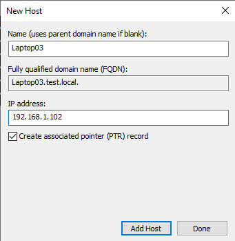

#### Übersicht der DNS-Einträge

Hier ist die Übersicht der erstellten DNS-Einträge:

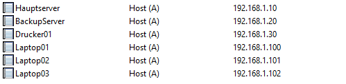

  
- **Datei- und Druckdienste:**
  - Installationsschritte mit Screenshots
  - Konfiguration der Freigaben
  - Installation und Konfiguration des Druckers
  - Tests und Ergebnisse
  
- **Webserver (IIS):**
  -Installationsschritte mit Screenshots
  - Erstellen und Konfigurieren der Webseite
  - Aktivierung von HTTPS und Installation des Zertifikats
  - Tests und Ergebnisse
