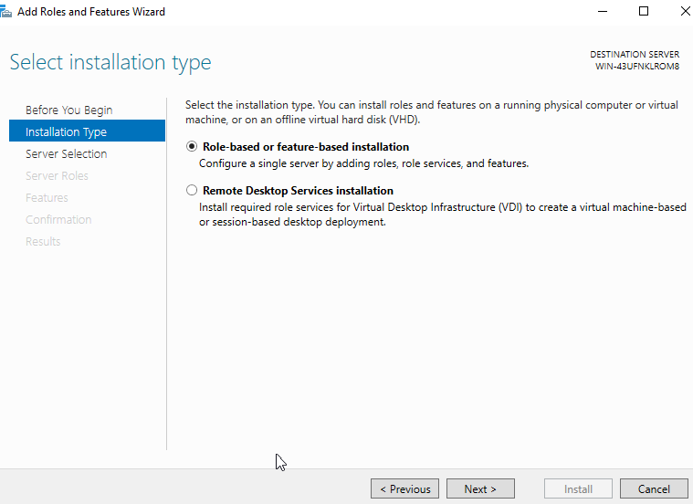
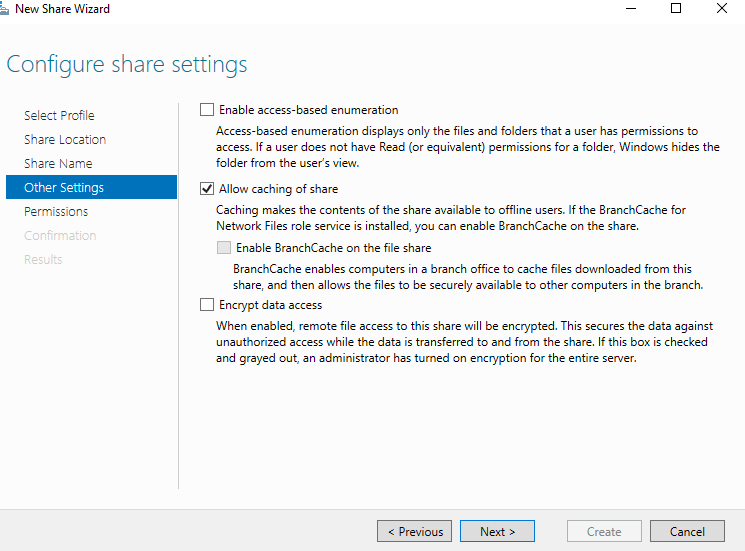
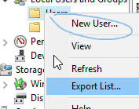
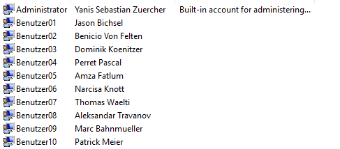
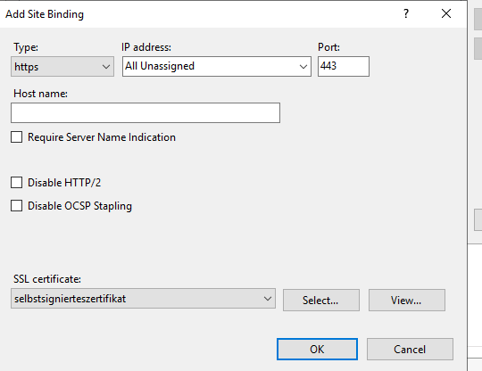
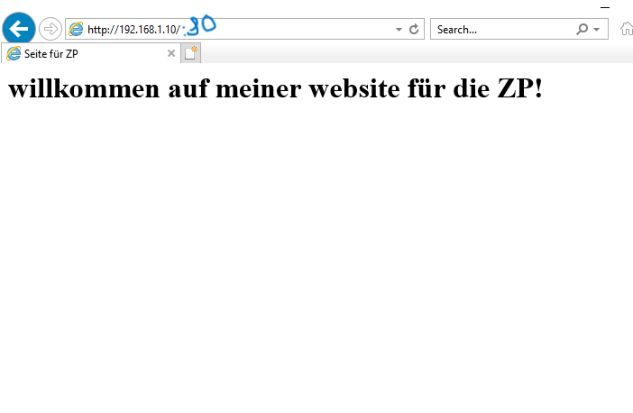

# Fallstudie WISS Modul 123

- Yanis Sebastian Zuercher & Dominik Koenitzer
- 26.06.24
## Rollen
- **Yanis Sebastian Zuercher**
    - Dokumentation
    - Bilder
    - VM aufsetzen
    - DHCP, DNS, IIS, Print & Benutzerfreigabe aufsetzen
- **Dominik Könitzer**
    - Tests durchführen & Fehlerbehebung
## Inhaltsverzeichnis
- [Einführung](#einführung)
- [Planung](#planung)
  - [Netzwerkplan](#netzwerkplan)
  - [Adressplanung (Tabellenform)](#adressplanung-tabellenform)
  - [Berechtigungsmatrix](#berechtigungsmatrix)
  - [Namenskonzepte](#namenskonzepte)
- [Installation des Windows Server 2019 in einer VM](#installation-des-windows-server-2019-in-einer-vm)
- [Einrichtung der Dienste](#einrichtung-der-dienste)
  - [DHCP-Server](#dhcp-server)
    - [Installationsschritte](#installationsschritte)
    - [Ausschlüsse und Reservierungen](#ausschlüsse-und-reservierungen)
  - [DNS-Server](#dns-server)
    - [Installationsschritte](#installationsschritte-1)
    - [Erstellen von DNS-Einträgen](#erstellen-von-dns-einträgen)
  - [Datei- und Druckdienste](#datei--und-druckdienste)
  - [Webinstallation (IIS)](#webinstallation-iis)
    - [Installationsschritte](#installationsschritte-2)
    - [Showcase](#showcase)
- [Tests (Dominik Könitzer)](#tests-dominik-könitzer)
  - [IIS](#iis)
    - [Testkonzept für den IIS (Internet Information Services) Webserver](#testkonzept-für-den-iis-internet-information-services-webserver)
  - [Drucker- und Benutzerfreigabe](#drucker--und-benutzerfreigabe)
    - [Testkonzept für die Drucker- und Benutzerfreigabe](#testkonzept-für-die-drucker--und-benutzerfreigabe)
  - [DNS](#dns)
    - [Testkonzept für den DNS-Server](#testkonzept-für-den-dns-server)
  - [DHCP](#dhcp)
    - [Testkonzept für den DHCP-Server](#testkonzept-für-den-dhcp-server)

## Einführung

In diesem Projekt wird eine IT-Infrastruktur für eine kleine Organisation aufgebaut. Die Hauptziele sind:

- Einrichtung eines Windows Server 2019 in einer virtuellen Maschine
- Konfiguration von DHCP, DNS, IIS, Druck- und Dateidiensten
- Sicherstellung der Netzwerksicherheit und Zugriffsrechte
- Dokumentation der Konfigurationsschritte und Durchführung von Tests

## Planung
### Netzwerkplan

### Adressplanung (Tabellenform)
<table border="1">
    <tr>
        <th>Ressource</th>
        <th>IP-Adresse</th>
        <th>Zuweisung</th>
    </tr>
    <tr>
        <td>Hauptserver</td>
        <td>192.168.1.10</td>
        <td>Statisch</td>
    </tr>
    <tr>
        <td>Backup-Server</td>
        <td>192.168.1.20</td>
        <td>Statisch</td>
    </tr>
    <tr>
        <td>Drucker</td>
        <td>192.168.1.30</td>
        <td>Statisch</td>
    </tr>
    <tr>
        <td>Laptop01</td>
        <td>192.168.1.100</td>
        <td>DHCP</td>
    </tr>
    <tr>
        <td>Laptop02</td>
        <td>192.168.1.101</td>
        <td>DHCP</td>
    </tr>
    <tr>
        <td>Laptop03</td>
        <td>192.168.1.102</td>
        <td>DHCP</td>
    </tr>
    <tr>
        <td>Laptop04</td>
        <td>192.168.1.103</td>
        <td>DHCP</td>
    </tr>
    <tr>
        <td>Laptop05</td>
        <td>192.168.1.104</td>
        <td>DHCP</td>
    </tr>
</table>

### Berechtigungsmatrix
<table border="1">
    <tr>
        <th>Ressource</th>
        <th>Benutzer01</th>
        <th>Benutzer02</th>
        <th>Benutzer03</th>
        <th>Benutzer04</th>
        <th>Benutzer05</th>
        <th>Benutzer06</th>
        <th>Benutzer07</th>
        <th>Benutzer08</th>
        <th>Benutzer09</th>
        <th>Benutzer10</th>
        <th>Admin</th>
    </tr>
    <tr>
        <td>Dateien</td>
        <td>r</td>
        <td>rw</td>
        <td>r</td>
        <td>r</td>
        <td>rw</td>
        <td>r</td>
        <td>rw</td>
        <td>r</td>
        <td>r</td>
        <td>rw</td>
        <td>rwx</td>
    </tr>
    <tr>
        <td>Drucker</td>
        <td>Ja</td>
        <td>Ja</td>
        <td>Ja</td>
        <td>Ja</td>
        <td>Ja</td>
        <td>Ja</td>
        <td>Ja</td>
        <td>Ja</td>
        <td>Ja</td>
        <td>Ja</td>
        <td>Ja</td>
    </tr>
    <tr>
        <td>Backup-Server</td>
        <td>Nein</td>
        <td>Nein</td>
        <td>Nein</td>
        <td>Nein</td>
        <td>Nein</td>
        <td>Nein</td>
        <td>Nein</td>
        <td>Nein</td>
        <td>Nein</td>
        <td>Nein</td>
        <td>Ja</td>
    </tr>
</table>

### Namenskonzepte
- **Geräte:**
  - Hauptserver: Hauptserver
  - Backup-Server: BackupServer
  - Drucker: Drucker01
  - Laptops: Laptop01, Laptop02, Laptop03, Laptop04, Laptop05
  
- **Benutzerkonten:**
  - Benutzer01: Jason Bichsel
  - Benutzer02: Benicio Von Felten
  - Benutzer03: Dominik Könitzer
  - Benutzer04: Perret Pascal
  - Benutzer05: Amza Fatlum
  - Benutzer06: Narcisa Knott
  - Benutzer07: Thomas Waelti
  - Benutzer08: Aleksandar Travanov
  - Benutzer09: Marc Bahnmüller
  - Benutzer10: Patrick Meier
  - Admin: Yanis Sebastian Zürcher
## Installation des Windows Server 2019 in einer VM
**Schritt 1:** Neue VM erstellen

Im VirtualBox Manager auf "Neu" geklickt, um eine neue virtuelle Maschine zu erstellen.

**Schritt 2:** VM konfigurieren

- Name: Windows Server 2019
- Speicherort der VM angegeben
- ISO-Datei für Windows Server 2019 ausgewählt
- "Unattended Installation überspringen" aktiviert

**Schritt 3:** Hardware konfigurieren

- RAM zugewiesen: 14662 MB
- CPUs zugewiesen: 12
- Es sollte im grünen Bereich sein, wie im Bild dargestellt.

**Schritt 4:** Virtuelle Festplatte erstellen

- Festplattengrösse: 120 GB

**Schritt 5:** VM-Einstellungen überprüfen und erstellen

- Einstellungen überprüft und auf "Fertigstellen" geklickt

**Schritt 6:** VM starten

- Windows Server 2019 VM ausgewählt und auf "Starten" geklickt

**Schritt 7:** Windows Setup starten

- Sprache, Zeit- und Währungsformat und Tastaturlayout ausgewählt
- Auf "Jetzt installieren" geklickt

**Schritt 8:** Betriebssystem auswählen

- Edition: Windows Server 2019 Standard Evaluation (Desktop Experience) ausgewählt

**Schritt 9:** Lizenzbedingungen akzeptieren

- Lizenzbedingungen akzeptiert

**Schritt 10:** Installationsart auswählen

- "Benutzerdefiniert: Nur Windows installieren (erweitert)" ausgewählt

**Schritt 11:** Laufwerk zur Installation auswählen

- Nicht zugewiesenen Speicherplatz (120 GB) ausgewählt und auf "Weiter" geklickt

**Schritt 12:** Windows installieren

- Installationsprozess gestartet, Fortschritt verfolgt

**Schritt 13:** Administrator-Konto einrichten

- Passwort für das Administratorkonto festgelegt

**Schritt 14:** Windows Setup abschliessen

- Nach Abschluss des Setups, Anmeldebildschirm erreicht

## Einrichtung der Dienste
### DHCP-Server
#### Installationsschritte:

**Schritt 1:** Öffnen des Server Managers

Im Server Manager habe ich auf "Add roles and features" geklickt, um die Rolle des DHCP-Servers hinzuzufügen.

**Schritt 2:** DHCP-Server Rolle auswählen

Ich habe die Rolle "DHCP Server" ausgewählt und installiert.

**Schritt 3:** DHCP-Manager öffnen

Nach der Installation habe ich im Server Manager auf "Tools" geklickt und dann "DHCP" ausgewählt.

**Schritt 4:** Neuen Bereich hinzufügen

Im DHCP-Manager habe ich auf "IPv4" rechtsgeklickt und "New Scope..." ausgewählt.

**Schritt 5:** Bereich benennen

Ich habe den Bereich "Scope1" genannt und eine Beschreibung "1" hinzugefügt.

**Schritt 6:** IP-Adressbereich festlegen

Ich habe den Start-IP-Bereich auf `192.168.1.100` und den End-IP-Bereich auf `192.168.1.200` festgelegt. Die Subnetzmaske ist `255.255.255.0`.

**Schritt 7:** Ausschlüsse und Verzögerung

Ich habe keine Ausschlüsse hinzugefügt und die Standardverzögerung beibehalten.

**Schritt 8:** Lease-Dauer festlegen

Ich habe die Lease-Dauer auf 8 Tage eingestellt.

**Schritt 9:** DHCP-Optionen konfigurieren

Ich habe ausgewählt, dass ich die DHCP-Optionen jetzt konfigurieren möchte.

**Schritt 10:** Standard-Gateway konfigurieren

Ich habe die IP-Adresse des Routers als `192.168.1.1` hinzugefügt.

**Schritt 11:** DNS-Server konfigurieren

Ich habe `192.168.1.10` und `8.8.8.8` als DNS-Server hinzugefügt.

**Schritt 12:** WINS-Server konfigurieren

Ich habe keine WINS-Server hinzugefügt.

**Schritt 13:** Bereich aktivieren

Ich habe ausgewählt, dass der Bereich jetzt aktiviert wird.

**Schritt 14:** Assistent beenden

Ich habe den Assistenten gefinished.

#### Ausschlüsse und Reservierungen

**Schritt 1:** Neue Reservierung hinzufügen

Im DHCP-Manager habe ich auf "Reservations" rechtsgeklickt und "New Reservation..." ausgewählt.

**Schritt 2:** Reservierung für Laptop01

Ich habe eine Reservierung für `Laptop01` mit der IP-Adresse `192.168.1.100` und der MAC-Adresse `90:5b:cd:69:7b:c2` erstellt. Beschreibung: `Benutzer01 - Jason Bichsel`.

**Schritt 3:** Reservierung für Laptop02

Ich habe eine Reservierung für `Laptop02` mit der IP-Adresse `192.168.1.101` und der MAC-Adresse `ab:12:14:56:00:36` erstellt. Beschreibung: `Benutzer02 - Benicio Von Felten`.

**Schritt 4:** Reservierung für Laptop03

Ich habe eine Reservierung für `Laptop03` mit der IP-Adresse `192.168.1.102` und der MAC-Adresse `5c:e:3:59:1e:b0:62` erstellt. Beschreibung: `Benutzer03 - Dominik Koenitzer`.

**Schritt 5:** Reservierung für Laptop04

Ich habe eine Reservierung für `Laptop04` mit der IP-Adresse `192.168.1.103` und der MAC-Adresse `77:1e:17:03:ca:5b` erstellt. Beschreibung: `Benutzer04 - Perret Pascal`.

**Schritt 6:** Reservierung für Laptop05

Ich habe eine Reservierung für `Laptop05` mit der IP-Adresse `192.168.1.104` und der MAC-Adresse `16:79:be:6e:70:60` erstellt. Beschreibung: `Benutzer05 - Amza Fatlum`.

  
## DNS-Server
#### Installationsschritte:

**Schritt 1:** Öffnen des Server Managers

Im Server Manager habe ich auf "Add roles and features" geklickt, um die Rolle des DNS-Servers hinzuzufügen.

**Schritt 2:** DNS-Server Rolle auswählen

Ich habe die Rolle "DNS Server" ausgewählt und installiert.

**Schritt 3:** DNS-Manager öffnen

Nach der Installation habe ich im Server Manager auf "Tools" geklickt und dann "DNS" ausgewählt.

**Schritt 4:** Neue Zone hinzufügen

Im DNS-Manager habe ich auf "Forward Lookup Zones" rechtsgeklickt und "New Zone..." ausgewählt.

**Schritt 5:** Zonentyp auswählen

Ich habe "Primary zone" ausgewählt.

**Schritt 6:** Zonenname eingeben

Ich habe den Zonennamen "test.local" eingegeben.

**Schritt 7:** Zonen-Datei erstellen

Ich habe ausgewählt, eine neue Zonen-Datei zu erstellen mit dem Namen "test.local.dns".

**Schritt 8:** Dynamische Updates konfigurieren

Ich habe ausgewählt, dass keine dynamischen Updates erlaubt sind.

**Schritt 9:** Assistent beenden

Ich habe den Assistenten gefinished.

**Schritt 10:** Reverse Lookup Zone hinzufügen

Im DNS-Manager habe ich auf "Reverse Lookup Zones" rechtsgeklickt und "New Zone..." ausgewählt.

**Schritt 11:** Zonentyp auswählen

Ich habe "Primary zone" ausgewählt.

**Schritt 12:** IPv4 Reverse Lookup Zone auswählen

Ich habe "IPv4 Reverse Lookup Zone" ausgewählt.

**Schritt 13:** Reverse Lookup Zone Name eingeben

Ich habe den Namen der Reverse Lookup Zone als "0.1.168.192.in-addr.arpa" eingegeben.

**Schritt 14:** Zonen-Datei erstellen

Ich habe ausgewählt, eine neue Zonen-Datei zu erstellen mit dem Namen "0.1.168.192.in-addr.arpa.dns".

**Schritt 15:** Dynamische Updates konfigurieren

Ich habe ausgewählt, dass keine dynamischen Updates erlaubt sind.

**Schritt 16:** Assistent beenden

Ich habe den Assistenten gefinished.

#### Erstellen von DNS-Einträgen

**Schritt 1:** Neuen Host hinzufügen

Im DNS-Manager habe ich auf die Forward Lookup Zone "test.local" rechtsgeklickt und "New Host (A or AAAA)..." ausgewählt.

**Schritt 2:** Host für Hauptserver hinzufügen

Ich habe einen neuen Host "Hauptserver" mit der IP-Adresse "192.168.1.10" hinzugefügt.

**Schritt 3:** Host für BackupServer hinzufügen

Ich habe einen neuen Host "BackupServer" mit der IP-Adresse "192.168.1.20" hinzugefügt.

**Schritt 4:** Host für Drucker hinzufügen

Ich habe einen neuen Host "Drucker01" mit der IP-Adresse "192.168.1.30" hinzugefügt.

**Schritt 5:** Host für Laptop01 hinzufügen

Ich habe einen neuen Host "Laptop01" mit der IP-Adresse "192.168.1.100" hinzugefügt.

**Schritt 6:** Host für Laptop02 hinzufügen

Ich habe einen neuen Host "Laptop02" mit der IP-Adresse "192.168.1.101" hinzugefüt.

**Schritt 7:** Host für Laptop03 hinzufügen

Ich habe einen neuen Host "Laptop03" mit der IP-Adresse "192.168.1.102" hinzugefügt.

#### Übersicht der DNS-Einträge

Hier ist die Übersicht der erstellten DNS-Einträge:

  
## Datei- und Druckdienste

**Schritt 1:** Öffnen des Server Managers

Im Server Manager habe ich auf "Add roles and features" geklickt. Und alle Schritte gemacht um print and document services herunterzuladen und file and storage services herunterzuladen

**Schritt 2:** Printer aufsetzewn

**Schritt 3:** File and Storage services

**Zwischen-Schritt 3.5:** benutzer einrichten wie in der tabelle

###### Showcase der benutzer:

**Weiter mit Schritt 3:** File and Storage services

  
## Webinstallation (IIS)

#### Installationsschritte:
**Schritt 1:** IIS installieren

**Schritt 2:** IIS aufsetzen

**Schritt 3:** Certificate

**Showcase:**

# Tests (Dominik Könitzer)
## IIS
### Testkonzept für den IIS (Internet Information Services) Webserver

#### 1. Testziel
Das Ziel meines Tests besteht darin sicherzustellen, dass der IIS-Webserver korrekt konfiguriert ist, HTTPS-Verbindungen unterstützt, die bereitgestellte Webseite zugänglich ist und die Sicherheitszertifikate ordnungsgemäss funktionieren.

#### 2. Testumfang
Der Test umfasst die Überprüfung der folgenden Punkte:
- Zugänglichkeit der Webseite über HTTP und HTTPS
- Korrektheit des installierten SSL-Zertifikats
- Funktionsfähigkeit der Webseite auf verschiedenen Clients
- Überprüfung der Sicherheitskonfiguration

#### 3. Testumgebung
- Webserver: Windows Server 2019 mit IIS-Rolle
- Netzwerk: Lokales Netzwerk mit IP-Bereich 192.168.1.0/24
- Test-Clients: Mehrere Clients (Laptops, Desktops) im Netzwerk
- Webseite: Eine einfache HTML-Seite, die auf dem IIS gehostet wird
- SSL-Zertifikat: Selbstsigniertes Zertifikat

#### 4. Testfälle

##### Testfall 1: Zugänglichkeit der Webseite über HTTP
**Voraussetzung:**
- Die Webseite ist auf dem IIS-Webserver bereitgestellt.
- HTTP ist auf dem Webserver konfiguriert.

**Schritte:**
1. Ich öffne einen Webbrowser auf einem Client im Netzwerk.
2. Ich gebe die IP-Adresse des Webservers mit dem HTTP-Protokoll ein ( `http://192.168.1.10`).

**Erwartetes Ergebnis:**
- Die Webseite wird korrekt im Browser angezeigt.

##### Testfall 2: Zugänglichkeit der Webseite über HTTPS
**Voraussetzung:**
- Die Webseite ist auf dem IIS-Webserver bereitgestellt.
- HTTPS ist auf dem Webserver konfiguriert und ein SSL-Zertifikat ist installiert.

**Schritte:**
1. Ich öffne einen Webbrowser auf einem Client im Netzwerk.
2. Ich gebe die IP-Adresse des Webservers mit dem HTTPS-Protokoll ein (`https://192.168.1.10`).

**Erwartetes Ergebnis:**
- Die Webseite wird korrekt im Browser angezeigt.
- Es erscheint ein Sicherheitshinweis bezüglich des selbstsignierten Zertifikats.

##### Testfall 3: Überprüfung des SSL-Zertifikats
**Voraussetzung:**
- Ein SSL-Zertifikat ist auf dem Webserver installiert und konfiguriert.

**Schritte:**
1. Ich öffne die Webseite über HTTPS auf einem Webbrowser.
2. Ich überprüfe die Zertifikatsinformationen im Browser.

**Erwartetes Ergebnis:**
- Das SSL-Zertifikat wird als selbstsigniert angezeigt.
- Die Zertifikatsinformationen stimmen mit den konfigurierten Details überein.

##### Testfall 4: Funktionsfähigkeit der Webseite auf verschiedenen Clients
**Voraussetzung:**
- Die Webseite ist auf dem IIS-Webserver bereitgestellt.

**Schritte:**
1. Ich öffne die Webseite auf verschiedenen Clients (Laptops, Desktops) im Netzwerk.
2. Ich überprüfe, ob die Webseite auf allen Clients korrekt angezeigt wird.

**Erwartetes Ergebnis:**
- Die Webseite wird auf allen getesteten Clients korrekt angezeigt.

##### Testfall 5: Überprüfung der Sicherheitskonfiguration
**Voraussetzung:**
- Der IIS-Webserver ist konfiguriert und läuft.

**Schritte:**
1. Ich überprüfe die Sicherheitseinstellungen im IIS-Manager.
2. Ich stelle sicher, dass nur notwendige Protokolle und Ports geöffnet sind.
3. Ich überprüfe die Protokollierung und Überwachungsfunktionen.

**Erwartetes Ergebnis:**
- Die Sicherheitskonfiguration ist korrekt eingerichtet und nur notwendige Protokolle und Ports sind aktiviert.

#### 5. Fehlerbehebung

Während des Tests stellte ich fest, dass die Webseite über HTTPS nicht erreichbar war. Nach Überprüfung der IIS-Konfiguration stellte ich fest, dass das SSL-Zertifikat nicht korrekt gebunden war. Ich habe das Zertifikat erneut gebunden und die Webseite war anschliessend über HTTPS erreichbar.

## Drucker- und Benutzerfreigabe
### Testkonzept für die Drucker- und Benutzerfreigabe

#### 1. Testziel
Das Ziel meines Tests besteht darin, sicherzustellen, dass der Druckserver ordnungsgemäss konfiguriert ist, Druckaufträge korrekt verarbeitet und die Benutzerfreigaben für Netzwerkressourcen wie Dateien und Ordner ordnungsgemäss funktionieren.

#### 2. Testumfang
Der Test umfasst die Überprüfung der folgenden Punkte:
- Funktionalität des Druckservers
- Druckaufträge von verschiedenen Clients
- Überprüfung der Freigaben von Dateien und Ordnern
- Zugriffsrechte der Benutzer auf freigegebene Ressourcen

#### 3. Testumgebung
- Druckserver: Windows Server 2019 mit konfiguriertem Druckdienst
- Netzwerk: Lokales Netzwerk mit IP-Bereich 192.168.1.0/24
- Test-Clients: Mehrere Clients (Laptops, Desktops) im Netzwerk
- Freigegebene Ressourcen: Ordner und Dateien auf dem Server

#### 4. Testfälle

##### Testfall 1: Überprüfung der Druckserver-Funktionalität
**Voraussetzung:**
- Der Druckserver ist installiert und konfiguriert.
- Ein Netzwerkdrucker ist hinzugefügt.

**Schritte:**
1. Ich starte den Druckserver.
2. Ich konfiguriere einen Client, um den Netzwerkdrucker zu verwenden.

**Erwartetes Ergebnis:**
- Der Client kann Druckaufträge an den Netzwerkdrucker senden und diese werden korrekt gedruckt.

##### Testfall 2: Druckaufträge von verschiedenen Clients
**Voraussetzung:**
- Der Druckserver ist installiert und konfiguriert.
- Ein Netzwerkdrucker ist hinzugefügt.

**Schritte:**
1. Ich sende Druckaufträge von verschiedenen Clients an den Netzwerkdrucker.
2. Ich überwache die Druckwarteschlange, um sicherzustellen, dass alle Aufträge korrekt verarbeitet werden.

**Erwartetes Ergebnis:**
- Alle Druckaufträge werden korrekt gedruckt und die Druckwarteschlange zeigt keine Fehler.

##### Testfall 3: Überprüfung der Freigaben von Dateien und Ordnern
**Voraussetzung:**
- Ordner und Dateien sind auf dem Server freigegeben.
- Benutzer haben entsprechende Berechtigungen.

**Schritte:**
1. Ich greife von verschiedenen Clients auf die freigegebenen Ordner und Dateien zu.
2. Ich überprüfe, ob die Benutzer gemäss ihren Berechtigungen auf die Ressourcen zugreifen können.

**Erwartetes Ergebnis:**
- Benutzer können auf die freigegebenen Ordner und Dateien zugreifen, gemäss den ihnen zugewiesenen Berechtigungen.

##### Testfall 4: Zugriffsrechte der Benutzer auf freigegebene Ressourcen
**Voraussetzung:**
- Benutzerkonten und Berechtigungen sind auf dem Server konfiguriert.

**Schritte:**
1. Ich überprüfe die Zugriffsrechte der Benutzer auf die freigegebenen Ordner und Dateien.
2. Ich stelle sicher, dass Benutzer nur auf die Ressourcen zugreifen können, für die sie Berechtigungen haben.

**Erwartetes Ergebnis:**
- Benutzer können nur auf die freigegebenen Ressourcen zugreifen, für die sie Berechtigungen haben, und alle unberechtigten Zugriffsversuche werden blockiert.

#### 5. Fehlerbehebung

Während des Tests stellte ich fest, dass ein Benutzer keinen Zugriff auf einen freigegebenen Ordner hatte, obwohl ihm die entsprechenden Berechtigungen zugewiesen waren. Nach Überprüfung der Berechtigungseinstellungen stellte ich fest, dass die Vererbung der Berechtigungen deaktiviert war. Ich aktivierte die Vererbung und der Benutzer konnte anschliessend auf den freigegebenen Ordner zugreifen.

## DNS
### Testkonzept für den DNS-Server

#### 1. Testziel
Das Ziel meines Tests besteht darin sicherzustellen, dass der DNS-Server korrekt konfiguriert ist und die DNS-Auflösung innerhalb des Netzwerks einwandfrei funktioniert. Dazu gehört die Überprüfung der Forward Lookup Zone, der Reverse Lookup Zone sowie die Überprüfung von DNS-Einträgen.

#### 2. Testumfang
Der Test umfasst die Überprüfung der folgenden Punkte:
- Funktionalität der Forward Lookup Zone
- Funktionalität der Reverse Lookup Zone
- Korrektheit der DNS-Einträge
- DNS-Auflösung von Clients im Netzwerk

#### 3. Testumgebung
- DNS-Server: Windows Server 2019 mit installierter DNS-Rolle
- Netzwerk: Lokales Netzwerk mit IP-Bereich 192.168.1.0/24
- Test-Clients: Mehrere Clients (Laptops, Desktops) im Netzwerk
- DNS-Zonen: Forward Lookup Zone und Reverse Lookup Zone konfiguriert

#### 4. Testfälle

##### Testfall 1: Überprüfung der Forward Lookup Zone
**Voraussetzung:**
- Die Forward Lookup Zone ist auf dem DNS-Server konfiguriert.

**Schritte:**
1. Ich öffne die DNS-Manager-Konsole auf dem DNS-Server.
2. Ich navigiere zur Forward Lookup Zone und überprüfe die dort konfigurierten DNS-Einträge.

**Erwartetes Ergebnis:**
- Die Forward Lookup Zone enthält die korrekten DNS-Einträge für die Server und Geräte im Netzwerk.

##### Testfall 2: Überprüfung der Reverse Lookup Zone
**Voraussetzung:**
- Die Reverse Lookup Zone ist auf dem DNS-Server konfiguriert.

**Schritte:**
1. Ich öffne die DNS-Manager-Konsole auf dem DNS-Server.
2. Ich navigiere zur Reverse Lookup Zone und überprüfe die dort konfigurierten PTR-Einträge.

**Erwartetes Ergebnis:**
- Die Reverse Lookup Zone enthält die korrekten PTR-Einträge für die IP-Adressen der Server und Geräte im Netzwerk.

##### Testfall 3: Überprüfung der DNS-Einträge
**Voraussetzung:**
- DNS-Einträge sind in den Forward und Reverse Lookup Zonen konfiguriert.

**Schritte:**
1. Ich überprüfe die DNS-Einträge für spezifische Geräte (Hauptserver, BackupServer, Drucker01, Laptop01 etc...) im DNS-Manager.
2. Ich stelle sicher, dass die IP-Adressen und Namen korrekt konfiguriert sind.

**Erwartetes Ergebnis:**
- Die DNS-Einträge sind korrekt konfiguriert und stimmen mit den zugewiesenen IP-Adressen und Namen überein.

##### Testfall 4: DNS-Auflösung von Clients im Netzwerk
**Voraussetzung:**
- Clients im Netzwerk sind so konfiguriert, dass sie den DNS-Server für die Namensauflösung verwenden.

**Schritte:**
1. Ich öffne die Eingabeaufforderung auf einem Client im Netzwerk.
2. Ich führe den Befehl `nslookup <hostname>` aus, um die DNS-Auflösung zu überprüfen.

**Erwartetes Ergebnis:**
- Der DNS-Server löst die Hostnamen korrekt in die entsprechenden IP-Adressen auf.

##### Testfall 5: Reverse DNS-Auflösung von Clients im Netzwerk
**Voraussetzung:**
- Clients im Netzwerk sind so konfiguriert, dass sie den DNS-Server für die Namensauflösung verwenden.

**Schritte:**
1. Ich öffne die Eingabeaufforderung auf einem Client im Netzwerk.
2. Ich führe den Befehl `nslookup 192.168.1.10` aus, um die Reverse DNS-Auflösung zu überprüfen.

**Erwartetes Ergebnis:**
- Der DNS-Server löst die IP-Adressen korrekt in die entsprechenden Hostnamen auf.

#### 5. Fehlerbehebung

Während des Tests stellte ich fest, dass die Reverse Lookup Zone nicht korrekt funktionierte und keine PTR-Einträge auflöste. Nach Überprüfung der Konfiguration stellte ich fest, dass die Zone nicht korrekt erstellt wurde. Ich habe die Reverse Lookup Zone neu erstellt und die PTR-Einträge hinzugefügt. Anschliessend funktionierte die Reverse DNS-Auflösung einwandfrei.

## DHCP

### Testkonzept für den DHCP-Server

#### 1. Testziel
Das Ziel meines Tests besteht darin sicherzustellen, dass der DHCP-Server korrekt konfiguriert ist und die automatische Zuweisung von IP-Adressen an Clients im Netzwerk reibungslos funktioniert. Dazu gehört die Überprüfung der IP-Adressvergabe, der Ausschlüsse, der Reservierungen sowie der DHCP-Optionen.

#### 2. Testumfang
Der Test umfasst die Überprüfung der folgenden Punkte:
- Automatische Zuweisung von IP-Adressen
- Ausschlüsse und Reservierungen
- Konfiguration der DHCP-Optionen
- Lease-Dauer

#### 3. Testumgebung
- DHCP-Server: Windows Server 2019 mit installierter DHCP-Rolle
- Netzwerk: Lokales Netzwerk mit IP-Bereich 192.168.1.0/24
- Test-Clients: Mehrere Clients (Laptops, Desktops) im Netzwerk

#### 4. Testfälle

##### Testfall 1: Automatische Zuweisung von IP-Adressen
**Voraussetzung:**
- Der DHCP-Server ist konfiguriert und aktiviert.

**Schritte:**
1. Ich schalte einen Client im Netzwerk ein und stelle sicher, dass dieser so konfiguriert ist, dass er eine IP-Adresse automatisch über DHCP bezieht.
2. Ich überprüfe die IP-Adresse des Clients nach der Verbindung zum Netzwerk.

**Erwartetes Ergebnis:**
- Der Client erhält eine IP-Adresse aus dem konfigurierten Bereich (192.168.1.100 - 192.168.1.200).

##### Testfall 2: Überprüfung der Ausschlüsse
**Voraussetzung:**
- Bestimmte IP-Adressen sind im DHCP-Server als ausgeschlossen konfiguriert.

**Schritte:**
1. Ich schalte einen Client im Netzwerk ein und stelle sicher, dass dieser so konfiguriert ist, dass er eine IP-Adresse automatisch über DHCP bezieht.
2. Ich überprüfe die IP-Adresse des Clients und stelle sicher, dass sie nicht im Bereich der ausgeschlossenen Adressen liegt.

**Erwartetes Ergebnis:**
- Der Client erhält keine IP-Adresse aus dem Bereich der ausgeschlossenen Adressen.

##### Testfall 3: Überprüfung der Reservierungen
**Voraussetzung:**
- Es sind Reservierungen für bestimmte Geräte auf dem DHCP-Server konfiguriert.

**Schritte:**
1. Ich schalte einen Client mit einer reservierten MAC-Adresse ein und stelle sicher, dass dieser so konfiguriert ist, dass er eine IP-Adresse automatisch über DHCP bezieht.
2. Ich überprüfe die IP-Adresse des Clients nach der Verbindung zum Netzwerk.

**Erwartetes Ergebnis:**
- Der Client erhält die für ihn reservierte IP-Adresse.

##### Testfall 4: Überprüfung der DHCP-Optionen
**Voraussetzung:**
- DHCP-Optionen (Router, DNS-Server) sind auf dem DHCP-Server konfiguriert.

**Schritte:**
1. Ich schalte einen Client im Netzwerk ein und stelle sicher, dass dieser so konfiguriert ist, dass er eine IP-Adresse automatisch über DHCP bezieht.
2. Ich überprüfe die Netzwerkeinstellungen des Clients und stelle sicher, dass die DHCP-Optionen korrekt übernommen wurden.

**Erwartetes Ergebnis:**
- Der Client erhält die konfigurierten DHCP-Optionen (die IP-Adresse des Routers und die DNS-Server).

##### Testfall 5: Überprüfung der Lease-Dauer
**Voraussetzung:**
- Die Lease-Dauer ist auf dem DHCP-Server konfiguriert.

**Schritte:**
1. Ich überprüfe die Lease-Dauer in den Einstellungen des DHCP-Servers.
2. Ich stelle sicher, dass die Lease-Dauer den Anforderungen entspricht.

**Erwartetes Ergebnis:**
- Die Lease-Dauer ist korrekt konfiguriert und wird vom DHCP-Server entsprechend angewendet.

#### 5. Fehlerbehebung

Während des Tests stellte ich fest, dass ein Client keine IP-Adresse erhielt. Nach Überprüfung der DHCP-Server-Konfiguration stellte ich fest, dass die Netzwerkverbindung zum Server unterbrochen war. Nachdem ich die Netzwerkverbindung wiederhergestellt hatte, erhielt der Client erfolgreich eine IP-Adresse vom DHCP-Server.

